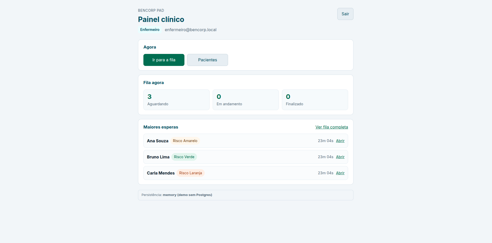
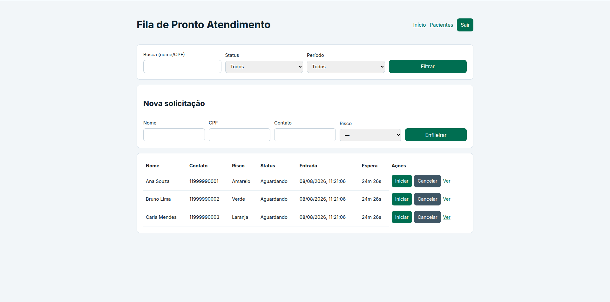
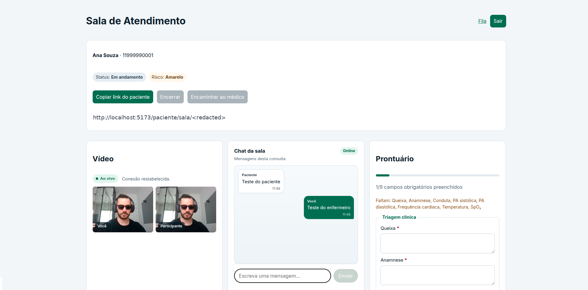
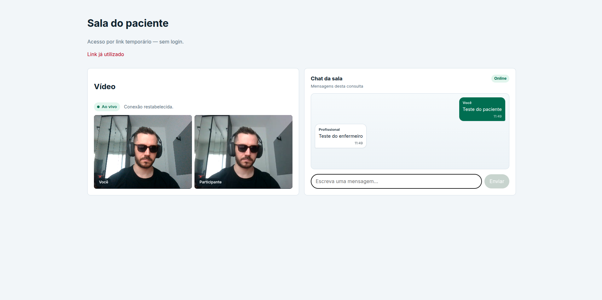

# BenCorp — Teleconsulta PAD

Plataforma simplificada de **Pronto Atendimento Digital** (teleconsulta) para o case técnico BenCorp.

Repositório: estrutura monorepo, API NestJS (Clean Architecture layer-first), web React/Vite, Postgres/Prisma, LiveKit.

## Sumário

1. [Pré-requisitos](#pré-requisitos)
2. [Subir com Docker (recomendado para avaliador)](#subir-com-docker-recomendado-para-avaliador)
3. [Demo rápida sem Postgres](#demo-rápida-sem-postgres)
4. [Desenvolvimento local](#desenvolvimento-local)
5. [Credenciais do seed](#credenciais-do-seed)
6. [Tour da UI — fluxo clínico](#tour-da-ui--fluxo-clínico)
7. [Estrutura do repositório](#estrutura-do-repositório)
8. [Scripts](#scripts)
9. [Documentação](#documentação)
10. [Limitações](#limitações)

## Pré-requisitos

- Node.js **20+** (`nvm use` lê `.nvmrc`)
- Docker + Docker Compose (stack completa)
- Git

## Subir com Docker (recomendado para avaliador)

```bash
cp .env.example .env
docker compose up --build
```

| Serviço | URL |
| --- | --- |
| Web | http://localhost:5173 |
| API | http://localhost:3000 |
| Health | http://localhost:3000/health |
| LiveKit | ws://localhost:7880 |

A API aplica migrations e seed no start (`PERSISTENCE_MODE=postgres`). Login com as [credenciais do seed](#credenciais-do-seed).

Parar: `docker compose down` (volume Postgres persiste; `down -v` zera dados).

## Demo rápida sem Postgres

Sem `PERSISTENCE_MODE` no `.env`, a API sonda o `DATABASE_URL`: se o Postgres não responder, sobe em **memory** automaticamente. Vídeo usa LiveKit real (SFU no Compose).

```bash
cp .env.example .env
nvm use
npm install
docker compose up -d livekit
npm run dev:api
# outro terminal
npm run dev:web
```

- Seed em memória (mesmos usuários da tabela abaixo)
- Badge na Home: **Persistência: memory**
- Reinício da API zera IDs em memória — links/URLs antigas de atendimento deixam de valer

| `PERSISTENCE_MODE` | Comportamento |
| --- | --- |
| *(omitido)* | Postgres se a porta do `DATABASE_URL` responder; senão `memory` |
| `postgres` | Prisma + PostgreSQL (entrega / Compose) |
| `memory` | Só memória + LiveKit |
| `write-behind` | Memória na request + flush best-effort + LiveKit |

Detalhes: [ADR-002](docs/architecture/adrs/002-persistencia-memoria-write-behind.md).

## Desenvolvimento local

```bash
cp .env.example .env
nvm use
docker compose up -d postgres livekit
npm install
cd apps/api && npx prisma migrate deploy && npx prisma db seed
# na raiz
npm run dev:api
# outro terminal
npm run dev:web
```

Com Postgres no ar e sem `PERSISTENCE_MODE`, a API escolhe `postgres` sozinha. Para forçar memória: `PERSISTENCE_MODE=memory`.

Fluxo clínico: ver [Tour da UI](#tour-da-ui--fluxo-clínico). Pacientes em `/pacientes` (ENFERMEIRO/MEDICO).

## Credenciais do seed

| E-mail | Senha | Papel |
| --- | --- | --- |
| admin@bencorp.local | Senha@123 | ADMIN |
| enfermeiro@bencorp.local | Senha@123 | ENFERMEIRO |
| medico@bencorp.local | Senha@123 | MEDICO |

Paciente **não** tem login — entra em `/paciente/sala/:token` via link gerado na sala.

## Tour da UI — fluxo clínico

Fluxo resumido: **login** → **painel** → **fila** → **iniciar** → **sala** (vídeo + chat + prontuário) → **link do paciente** → encerrar ou encaminhar.

### 1. Painel clínico (ENFERMEIRO / MEDICO)

Home operacional após o login: próximas ações, contagens da fila e maiores esperas. Badge de persistência fica no rodapé.



### 2. Fila de Pronto Atendimento

Filtros, nova solicitação e tabela com risco, status, espera e ações (Iniciar / Cancelar / Ver).



### 3. Sala de atendimento (profissional)

Três painéis: **vídeo** (LiveKit), **chat** e **prontuário** (triagem / vitais). Cabeçalho com status, risco, link do paciente e ações de encerrar/encaminhar.



### 4. Sala do paciente (sem login)

Acesso só pelo link temporário (uso único). Vídeo + chat; sem prontuário nem gestão clínica.



## Estrutura do repositório

```text
apps/api/src/
  app/          contracts (ports) + use-cases
  entities/     domínio puro (sem Nest/Prisma)
  externals/    Nest, Prisma, LiveKit, memória, JWT
apps/web/       React + Vite (+ PWA shell)
img/            capturas do fluxo clínico (README)
docs/architecture/
  case-checklist.md
  api-clean-architecture.md
  domain-analysis.md
  limitacoes-e-abordagem.md
  epics/CX-EJ/   # home clínica (Épico J)
  adrs/
docker-compose.yml
```

Imports da API: `@/*` → `src/*` (build reescreve aliases no `dist`; runtime de dev/prod também registra `@/` via `apps/api/scripts/register-path-aliases.cjs`). O bootstrap usa `import()` relativo do `AppModule` após `ensurePersistenceMode`. Guia: [api-clean-architecture.md](docs/architecture/api-clean-architecture.md).

Dockerfiles: `apps/api/Dockerfile`, `apps/web/Dockerfile` (nginx serve o build estático).

## Scripts

Na raiz do monorepo:

| Script | Descrição |
| --- | --- |
| `npm run dev:api` / `dev:web` | Desenvolvimento (API auto memory/postgres) |
| `VITE_DEV_HOST=0.0.0.0 npm run dev:web` | Vite escuta na LAN; HMR aponta para `localhost` |
| `npm test` / `npm run test:cov` | Testes da API + cobertura |
| `npm run lint` | ESLint da API |
| `npm run build` | Build API + web |

## Documentação

- Checklist CX: [docs/architecture/case-checklist.md](docs/architecture/case-checklist.md)
- Domínio: [docs/architecture/domain-analysis.md](docs/architecture/domain-analysis.md)
- Clean Architecture API: [docs/architecture/api-clean-architecture.md](docs/architecture/api-clean-architecture.md)
- Épico J (home clínica): [docs/architecture/epics/CX-EJ/](docs/architecture/epics/CX-EJ/)
- ADRs: [docs/architecture/adrs/](docs/architecture/adrs/)
- Limitações: [docs/architecture/limitacoes-e-abordagem.md](docs/architecture/limitacoes-e-abordagem.md)

## Limitações

Resumo; detalhes em [limitacoes-e-abordagem.md](docs/architecture/limitacoes-e-abordagem.md).

- JWT no `localStorage` (case; não produção)
- PWA só cacheia shell — sem PHI/API offline; SW só em build de produção
- LiveKit `--dev` com keys de desenvolvimento
- Modo `memory` volátil; write-behind sem garantia de durabilidade
- Home clínica agrega a fila do dia (`slim=true`, sem CPF/contato no payload); não é BI em tempo real
- React `StrictMode` ativo em dev (efeitos montam 2×); a sala de vídeo trata abort/retry para o LiveKit
- Sem rate limit / APM avançado
