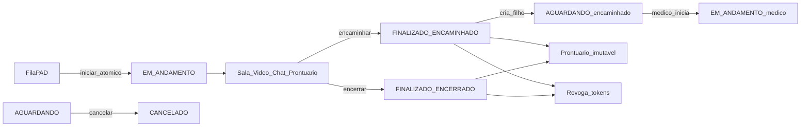
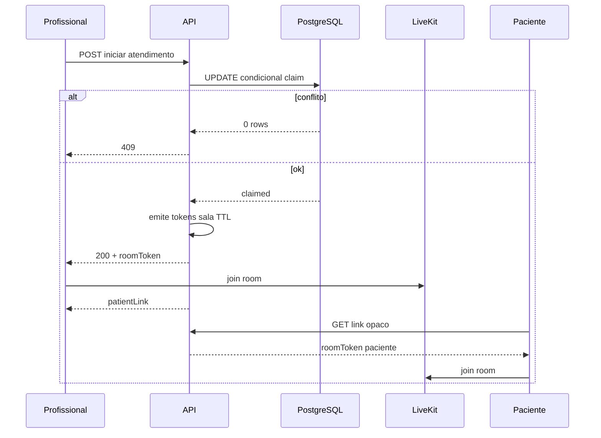

# Checklist do Case BenCorp — Teleconsulta PAD

- **Fonte:** CASE TÉCNICO – DEV FULLSTACK SÊNIOR – BENCORP (PDF)
- **Prazo de devolução:** 10/08/2026
- **Prazo do case:** 05 dias corridos
- **Domínio:** [domain-analysis.md](./domain-analysis.md)
- **Status dos itens:** `TODO` até implementação
- **Data deste inventário:** 2026-08-07

---

## 1. Meta do case

Construir uma plataforma simplificada de **teleconsulta / Pronto Atendimento Digital (PAD)** em que profissionais atendem pacientes por vídeo, registram prontuário e respeitam autorização **server-side**.

Requisitos transversais:

- Aplicação deve ser **PWA**
- Nenhuma rota, dado ou sala de vídeo acessível sem autorização explícita no backend (independente do frontend)
- Stack mínima: Node.js + TypeScript (NestJS ou Express), ORM com migrations (TypeORM ou Prisma), PostgreSQL, JWT, React, Docker, vídeo pronto (LiveKit / Jitsi / Daily)

### Premissas de stack deste projeto (fixadas)

| Camada | Escolha |
| --- | --- |
| Backend | NestJS + TypeScript |
| Arquitetura API | Clean Architecture + **layer-first** ([api-clean-architecture.md](./api-clean-architecture.md)) |
| ORM | Prisma + migrations (somente em `externals/database`) |
| Banco | PostgreSQL |
| Auth | JWT + RBAC |
| Frontend | React (Vite) + PWA mínima |
| Vídeo | LiveKit no Docker Compose (adapter atrás de port) |
| Chat | WebSocket no Nest + persistência (`externals/nest/ws` → `app/use-cases`) |
| Forma | Monólito com BCs em use cases / entities / controllers (`app` · `entities` · `externals`) |

---

## 2. Mapa rápido — perfis

| Perfil | Capacidades | Itens |
| --- | --- | --- |
| ENFERMEIRO | Home operacional, fila PAD, iniciar atendimento, triagem, encaminhar ao médico | CX-020–CX-038, CX-040–CX-049, CX-120–CX-126 |
| MEDICO | Home operacional, fila PAD, ver encaminhados, prescrição, completar prontuário | CX-020–CX-038, CX-040–CX-049, CX-120–CX-126 |
| ADMIN | Gerenciar usuários e papéis (RBAC); **sem** acesso a prontuário / home clínica | CX-010–CX-016, CX-049, CX-125 |
| PACIENTE | Sem login; entra na sala via link temporário | CX-060–CX-066, CX-071 |

Bounded contexts de referência: `IdentityAccess` · `Atendimento` · `Prontuario` · `Paciente` · `Telepresenca` · `Auditoria`.

### Decisão travada — encaminhar ao médico (fecha ambiguidade do PDF)

O PDF pede escolher **encaminhar** ou **encerrar** ao sair da sala, sem criar estado novo na máquina oficial.

**Regra adotada:**

1. Ambos os caminhos **finalizam** o atendimento atual (`EM_ANDAMENTO` → `FINALIZADO`) e **revogam** tokens da sala.
2. Desfecho persistido: `ENCERRADO` | `ENCAMINHADO_MEDICO`.
3. Se `ENCAMINHADO_MEDICO`: o sistema cria **novo** atendimento `AGUARDANDO` para o mesmo paciente, com `encaminhadoDeId` → atendimento concluído, herda classificação de risco, e fica na fila filtrável de encaminhados para o **MEDICO**.
4. Prontuário do atendimento finalizado fica **imutável** (correção só por adendo). O médico, ao iniciar o novo atendimento, abre **novo** prontuário; lê o anterior via histórico do paciente (com auditoria).
5. Não existe transição `EM_ANDAMENTO` → `AGUARDANDO` (fora do grafo → 422).

Itens: CX-035, CX-036, CX-038, CX-070.

---

## 3. Backlog por épico

Legenda de checkbox: `- [ ]` = TODO · `- [x]` = feito.

Cada item traz **Aceite** mensurável.

---

### Épico A — Fundação

**Contexto:** infra, bootstrap e segurança base.

- [x] **CX-001** — Estrutura do repositório (`apps/api`, `apps/web`, `docs/`, Docker)
  - **Aceite:** clone + árvore clara; README aponta para pastas; `apps/api/src` segue layer-first (`app/`, `entities/`, `externals/`) com imports `@/*` conforme [api-clean-architecture.md](./api-clean-architecture.md)
  - **BC:** transversal

- [x] **CX-002** — Docker Compose com `api`, `web`, `postgres`, `livekit`
  - **Aceite:** `docker compose up` sobe stack utilizável
  - **BC:** transversal

- [x] **CX-003** — API NestJS + TypeScript estrito (sem `any`) em Clean Architecture
  - **Aceite:** build TypeScript limpo; ESLint do projeto passa; `entities`/`app` sem imports de `@prisma/client` ou SDK de vídeo; Nest como composition root em `externals/nest`
  - **BC:** transversal

- [x] **CX-004** — Prisma schema + migrations versionadas + PostgreSQL
  - **Aceite:** `prisma migrate` aplica schema do zero; acesso a dados só via adapters em `externals/database/prisma` (ports em `app/contracts`)
  - **BC:** transversal

- [x] **CX-005** — Seed: ADMIN, ENFERMEIRO, MEDICO, pacientes, atendimentos na fila
  - **Aceite:** após seed, login e fila demonstráveis sem cadastro manual
  - **BC:** IdentityAccess, Paciente, Atendimento

- [x] **CX-006** — Autenticação JWT (login profissional/admin)
  - **Aceite:** token válido acessa rotas protegidas; inválido → 401
  - **BC:** IdentityAccess

- [x] **CX-007** — Guards RBAC por papel (`ENFERMEIRO`, `MEDICO`, `ADMIN`)
  - **Aceite:** papel sem permissão → 403 em rota protegida
  - **BC:** IdentityAccess

- [x] **CX-008** — Deny-by-design: ADMIN bloqueado em rotas clínicas (prontuário/histórico clínico)
  - **Aceite:** teste negativo ADMIN → 403 em endpoints de prontuário
  - **BC:** IdentityAccess, Prontuario

- [x] **CX-009** — Logging estruturado mínimo (correlation/request id)
  - **Aceite:** requests autenticados geram log com userId quando houver
  - **BC:** transversal

---

### Épico B — Identity & Admin

**Contexto:** `IdentityAccessContext`

- [x] **CX-010** — Tela/API de login
  - **Aceite:** ENFERMEIRO, MEDICO e ADMIN autenticam com credenciais do seed
  - **BC:** IdentityAccess

- [x] **CX-011** — ADMIN lista usuários
  - **Aceite:** somente ADMIN; outros papéis → 403
  - **BC:** IdentityAccess

- [x] **CX-012** — ADMIN cria usuário com papel
  - **Aceite:** novo usuário autentica com o papel atribuído
  - **BC:** IdentityAccess

- [x] **CX-013** — ADMIN atualiza papel/status do usuário
  - **Aceite:** mudança de papel reflete nas autorizações imediatamente
  - **BC:** IdentityAccess
  - **Nota:** “permissões” do PDF = papéis RBAC (`ENFERMEIRO` / `MEDICO` / `ADMIN`); sem ACL fina além do papel no escopo do case

- [x] **CX-014** — Paciente **não** possui conta/login
  - **Aceite:** não existe fluxo de login de paciente; acesso só por link de sala
  - **BC:** IdentityAccess, Paciente, Telepresenca

- [x] **CX-015** — Modelo `Usuario` separado de `Paciente`
  - **Aceite:** schema não exige User para Paciente
  - **BC:** IdentityAccess, Paciente

- [x] **CX-016** — UI admin mínima de gestão de usuários (sem navegação clínica)
  - **Aceite:** ADMIN não consegue abrir prontuário pela UI nem pela API
  - **BC:** IdentityAccess

---

### Épico C — Atendimento / Fila (Core)

**Contexto:** `AtendimentoContext`

- [x] **CX-020** — Modelo `Atendimento` com status `AGUARDANDO | EM_ANDAMENTO | FINALIZADO | CANCELADO`
  - **Aceite:** persistência e enum alinhados ao case
  - **BC:** Atendimento

- [x] **CX-021** — Máquina de estados: `AGUARDANDO → EM_ANDAMENTO → FINALIZADO`
  - **Aceite:** caminho feliz persiste na ordem correta
  - **BC:** Atendimento

- [x] **CX-022** — `CANCELADO` somente a partir de `AGUARDANDO`
  - **Aceite:** cancelar de `EM_ANDAMENTO`/`FINALIZADO` → 422
  - **BC:** Atendimento

- [x] **CX-023** — Transição fora do grafo → **422**
  - **Aceite:** matriz de transições inválidas coberta por testes
  - **BC:** Atendimento

- [x] **CX-024** — Iniciar atendimento com **claim atômico no banco** (não `if` pré-update)
  - **Aceite:** dois “Iniciar” concorrentes → um 2xx e um **409**; implementação via `UPDATE` condicional / constraint
  - **BC:** Atendimento

- [x] **CX-025** — Profissional com atendimento `EM_ANDAMENTO` não inicia outro
  - **Aceite:** tentativa → **409** `ConflictError`; regra testada
  - **BC:** Atendimento

- [x] **CX-026** — Um profissional por atendimento (exclusividade)
  - **Aceite:** segundo profissional no mesmo atendimento → 409
  - **BC:** Atendimento

- [x] **CX-027** — API listar fila PAD com colunas: nome, contato, classificação de risco, status, entrada na fila, tempo de espera
  - **Aceite:** payload contém todos os campos
  - **BC:** Atendimento, Paciente

- [x] **CX-028** — Filtro busca por Nome/CPF
  - **Aceite:** busca parcial por nome e exata/normalizada por CPF
  - **BC:** Atendimento, Paciente

- [x] **CX-029** — Filtro por status (Aguardando, Em atendimento, Finalizado, Cancelado)
  - **Aceite:** cada status retorna subconjunto correto
  - **BC:** Atendimento

- [x] **CX-030** — Filtro por período (Hoje, Ontem, Última semana, Todos)
  - **Aceite:** janelas de data corretas no fuso **America/Sao_Paulo**
  - **BC:** Atendimento

- [x] **CX-031** — Tela **Fila de Pronto Atendimento** (React)
  - **Aceite:** colunas + filtros + ações visíveis para ENFERMEIRO/MEDICO
  - **BC:** Atendimento

- [x] **CX-032** — Ação **[Iniciar Atendimento]**
  - **Aceite:** muda status, associa profissional; navega para `/atendimentos/:id` (sala LiveKit no Épico E)
  - **BC:** Atendimento, Telepresenca
  - **Nota:** sala real / tokens ficam para CX-060+

- [x] **CX-033** — Ação **[Ver Atendimento]**
  - **Aceite:** detalhe conforme status; dono `EM_ANDAMENTO` pode encerrar/encaminhar; placeholder sem prontuário/auditoria (Épico D)
  - **BC:** Atendimento, Prontuario, Auditoria
  - **Nota:** auditoria de leitura de prontuário (CX-046) no Épico D

- [x] **CX-034** — Criar solicitação na fila (seed + endpoint autenticado ENFERMEIRO/MEDICO/ADMIN operacional)
  - **Aceite:** novo item aparece como `AGUARDANDO`
  - **BC:** Atendimento, Paciente

- [x] **CX-035** — Encaminhar ao médico (desfecho `ENCAMINHADO_MEDICO`)
  - **Aceite:** atendimento atual → `FINALIZADO` + desfecho `ENCAMINHADO_MEDICO`; port de revogação chamado; nasce filho `AGUARDANDO` com `encaminhadoDeId` e mesma classificação de risco
  - **BC:** Atendimento, Prontuario, Telepresenca
  - **Nota:** imutabilidade de prontuário no Épico D

- [x] **CX-036** — Encerrar atendimento (desfecho `ENCERRADO`)
  - **Aceite:** status `FINALIZADO` + desfecho `ENCERRADO`; **não** cria filho; revogação via port
  - **BC:** Atendimento, Prontuario, Telepresenca
  - **Nota:** imutabilidade de prontuário no Épico D

- [x] **CX-037** — Cancelar atendimento (`AGUARDANDO` → `CANCELADO`) — API + ação na fila
  - **Aceite:** cancelamento só em `AGUARDANDO` → 2xx; demais status → 422; item some/aparece como Cancelado nos filtros
  - **BC:** Atendimento

- [x] **CX-038** — MEDICO lista/filtra **atendimentos encaminhados**
  - **Aceite:** endpoint/UI com `encaminhadosOnly`; ENFERMEIRO → 403 nesse filtro; coberto por teste
  - **BC:** Atendimento

---

### Épico D — Prontuário (Core)

**Contexto:** `ProntuarioContext` + `AuditoriaContext`

- [x] **CX-040** — Modelo de prontuário ligado ao atendimento (queixa, anamnese curta, sinais vitais, classificação de risco, conduta)
  - **Aceite:** CRUD/atualização só enquanto atendimento permitir edição
  - **BC:** Prontuario

- [x] **CX-041** — Sinais vitais: PA, FC, Temp, SpO₂ (mínimo avaliável)
  - **Aceite:** campos persistidos e exibidos na sala e no histórico
  - **BC:** Prontuario

- [x] **CX-042** — Triagem pelo ENFERMEIRO + definição da **classificação de risco**
  - **Aceite:** enfermeiro grava triagem no atendimento em andamento; classificação de risco persistida alimenta a coluna da fila (CX-027) e é herdada no filho ao encaminhar (CX-035)
  - **BC:** Prontuario, Atendimento

- [x] **CX-043** — Prescrição / complemento pelo MEDICO
  - **Aceite:** médico grava prescrição no prontuário do atendimento que iniciou; enfermeiro sem permissão de prescrição médica → 403
  - **BC:** Prontuario

- [x] **CX-044** — Prontuário **imutável** após finalização
  - **Aceite:** PUT/PATCH no conteúdo base → 422/403; dados inalterados
  - **BC:** Prontuario

- [x] **CX-045** — Correção apenas via **Adendo** (autor + timestamp próprios)
  - **Aceite:** adendo criado pós-finalização; não altera corpo original
  - **BC:** Prontuario

- [x] **CX-046** — Auditoria em **toda** leitura de prontuário (who, when, patientId, endpoint)
  - **Aceite:** GET de prontuário gera registro append-only verificável
  - **BC:** Auditoria, Prontuario

- [x] **CX-047** — Formulário de prontuário na **Sala de Atendimento**
  - **Aceite:** painel clínico editável conforme papel e status
  - **BC:** Prontuario, Telepresenca
  - **Nota:** layout completo com vídeo/chat no Épico E; formulário já na tela `/atendimentos/:id`

- [x] **CX-048** — Autorização server-side em endpoints de prontuário (anti-IDOR)
  - **Aceite:** token válido de outro recurso/paciente → 403/404; testes negativos
  - **BC:** Prontuario, IdentityAccess

- [x] **CX-049** — ADMIN não acessa prontuário (API + UI)
  - **Aceite:** 403 sistemático; coberto por teste
  - **BC:** Prontuario, IdentityAccess

---

### Épico E — Telepresença (vídeo + chat + link paciente)

**Contexto:** `TelepresencaContext` (+ provedor Generic LiveKit)

- [x] **CX-060** — Sala existe **somente** com status `EM_ANDAMENTO`
  - **Aceite:** emitir token com status diferente → 403/422
  - **BC:** Telepresenca, Atendimento

- [x] **CX-061** — Tokens de sala emitidos pelo backend, TTL ≤ 15 min, renováveis
  - **Aceite:** token expira; renew com atendimento ainda ativo funciona
  - **BC:** Telepresenca

- [x] **CX-062** — Token vinculado a atendimento + participante
  - **Aceite:** token de outro atendimento/participante rejeitado
  - **BC:** Telepresenca

- [x] **CX-063** — Link do paciente: token opaco, expirável, **uso único**, revogado ao concluir
  - **Aceite:** (1) segundo uso do mesmo link → falha (401/403/410), mesmo com atendimento ainda `EM_ANDAMENTO`; (2) link expirado → falha; (3) após `FINALIZADO`/revoke → falha
  - **BC:** Telepresenca

- [x] **CX-064** — Link de outro atendimento → **403**
  - **Aceite:** teste negativo cobrindo mismatch de atendimento
  - **BC:** Telepresenca

- [x] **CX-065** — Finalizar atendimento invalida **todos** os tokens da sala imediatamente
  - **Aceite:** renew/join após finalizar falha
  - **BC:** Telepresenca, Atendimento

- [x] **CX-066** — Paciente entra na sala **sem login**, só pelo link
  - **Aceite:** fluxo paciente não exige JWT de usuário
  - **BC:** Telepresenca

- [x] **CX-067** — Adapter LiveKit (port + ACL); Compose sobe LiveKit
  - **Aceite:** profissional e paciente conectam áudio/vídeo na sala ativa
  - **BC:** Telepresenca

- [x] **CX-068** — Chat textual na sala com persistência (WebSocket Nest)
  - **Aceite:** mensagens aparecem em tempo real e sobrevivem a refresh durante `EM_ANDAMENTO`
  - **BC:** Telepresenca

- [x] **CX-069** — Tela **Sala de Atendimento**: vídeo + chat + prontuário lado a lado
  - **Aceite:** três painéis visíveis em viewport desktop; usável em mobile
  - **BC:** Telepresenca, Prontuario

- [x] **CX-070** — Ao finalizar na sala: escolher **encaminhar ao médico** ou **encerrar atendimento**
  - **Aceite:** UI exige escolha exclusiva; `encaminhar` → CX-035; `encerrar` → CX-036; nenhum caminho viola o grafo de estados
  - **BC:** Atendimento, Telepresenca

- [x] **CX-071** — UI na sala: exibir/copiar **link do paciente** (profissional autorizado)
  - **Aceite:** profissional em `EM_ANDAMENTO` obtém URL/token de convite; paciente acessa sem login (CX-066); link respeita CX-063/064/065
  - **BC:** Telepresenca

---

### Épico F — Pacientes

**Contexto:** `PacienteContext` (read models)

- [x] **CX-080** — Listagem de pacientes
  - **Aceite:** ENFERMEIRO/MEDICO listam; ADMIN sem dados clínicos derivados de prontuário
  - **BC:** Paciente

- [x] **CX-081** — Busca por Nome/CPF
  - **Aceite:** filtros retornam subconjunto correto
  - **BC:** Paciente

- [x] **CX-082** — Detalhe do paciente: histórico de atendimentos
  - **Aceite:** lista atendimentos passados do paciente
  - **BC:** Paciente, Atendimento

- [x] **CX-083** — Detalhe: sinais vitais e prontuários anteriores
  - **Aceite:** conteúdo clínico visível só para papéis autorizados
  - **BC:** Paciente, Prontuario

- [x] **CX-084** — Leituras clínicas no detalhe passam pelo mesmo gate de auditoria
  - **Aceite:** abrir histórico/prontuário gera audit log
  - **BC:** Auditoria, Prontuario

- [x] **CX-085** — Tela **Pacientes** no frontend
  - **Aceite:** listagem + detalhe navegáveis
  - **BC:** Paciente

---

### Épico G — PWA & Qualidade

- [x] **CX-090** — PWA mínima: `manifest` + service worker (cache de shell)
  - **Aceite:** Lighthouse/installability básica; app instalável
  - **BC:** transversal
  - **Nota:** sem cache offline de PHI/dados clínicos

- [x] **CX-091** — Testes automatizados das regras críticas (409, 422, 403, imutabilidade, auditoria, tokens)
  - **Aceite:** suite verde; cobertura ≥ 80% nos módulos de regras de domínio
  - **BC:** Atendimento, Prontuario, Telepresenca, Auditoria

- [x] **CX-092** — Testes de autorização negativos (IDOR, ADMIN clínico, link cruzado)
  - **Aceite:** cenários 403/409/422 documentados e passando
  - **BC:** IdentityAccess + cores

- [x] **CX-093** — Tipagem estrita e ESLint limpo (sem `any`, sem disable)
  - **Aceite:** CI/local lint + tsc sem erros
  - **BC:** transversal

- [x] **CX-094** — Observabilidade mínima (logs de authz negada e claim 409)
  - **Aceite:** tentativas negadas aparecem em log estruturado
  - **BC:** transversal

---

### Épico H — Entrega GitHub (obrigatório do PDF)

- [x] **CX-100** — `README.md` com passo a passo local e Docker
  - **Aceite:** avaliador sobe o projeto só com o README
  - **BC:** transversal

- [x] **CX-101** — Estrutura de pastas clara e organizada
  - **Aceite:** API layer-first + BCs por subpasta; web e docs óbvios no README; conforme [api-clean-architecture.md](./api-clean-architecture.md)
  - **BC:** transversal

- [x] **CX-102** — ADRs / documentação de trade-offs e decisões técnicas
  - **Aceite:** pasta `docs/architecture/adrs/` (ou equivalente) com decisões de stack, concorrência, vídeo, authz
  - **BC:** transversal

- [x] **CX-103** — `Dockerfile` funcional (api e/ou web conforme Compose)
  - **Aceite:** build de imagem sem erro; serviço sobe no Compose
  - **BC:** transversal

- [x] **CX-104** — Documento de limitações técnicas e abordagem escolhida
  - **Aceite:** limitações explícitas (ex.: PWA mínima, escopo de prontuário, LiveKit self-host)
  - **BC:** transversal

- [x] **CX-105** — Nota de assistência à codificação (permitido pelo case)
  - **Aceite:** menção objetiva em `limitacoes-e-abordagem.md` (sem seção promocional no README)
  - **BC:** transversal

- [ ] **CX-106** — Repositório publicado / entregue até 10/08/2026
  - **Aceite:** material devolvido no prazo do processo seletivo
  - **BC:** transversal
  - **Nota:** código em `mateusfs/bencorp-teleconsulta`; envio formal ao processo fica com o candidato

---

### Épico I — Memória local & demo sem Postgres

**Contexto:** permitir demonstrar a API/web **sem PostgreSQL instalado**, com store em memória no Nest; opcionalmente sincronizar (write-behind) para o banco quando disponível.

- [x] **CX-110** — Modo de persistência configurável (`PERSISTENCE_MODE`)
  - **Aceite:** `memory` | `write-behind` | `postgres` documentados no README/`.env.example`
  - **BC:** transversal

- [x] **CX-111** — Store em memória como fonte de verdade da request
  - **Aceite:** em `memory`/`write-behind`, leituras/escritas de domínio passam pelos adapters de memória (ports intactos)
  - **BC:** transversal

- [x] **CX-112** — Seed em memória (ADMIN/ENFERMEIRO/MEDICO + fila)
  - **Aceite:** login e fila funcionam sem migrar/seed Prisma
  - **BC:** IdentityAccess, Atendimento

- [x] **CX-113** — Write-behind: resposta HTTP antes do flush no Postgres
  - **Aceite:** em `write-behind`, mutações atualizam memória imediatamente; após a resposta a API tenta persistir no banco (best-effort, sem falhar a request)
  - **BC:** transversal

- [x] **CX-114** — API sobe sem Postgres em `memory`
  - **Aceite:** `PERSISTENCE_MODE=memory` não exige `DATABASE_URL` válida nem `prisma migrate`
  - **BC:** transversal

- [x] **CX-115** — Health/UI mostram o modo ativo
  - **Aceite:** `GET /health` expõe `persistenceMode`; web exibe indicador na home (reposicionado como meta no Épico J / CX-125)
  - **BC:** transversal

- [x] **CX-116** — Limitações documentadas (volátil, sem HA, LiveKit opcional)
  - **Aceite:** README/ADR deixam claro que memória é para demo local; produção usa `postgres`
  - **BC:** transversal

---

### Épico J — Home clínica operacional (dashboard)

Melhoria de produto pós-core: a home de ENFERMEIRO/MEDICO deixa de ser só links + modo de persistência e vira **cockpit** (próxima ação, snapshot da fila, retomar sala). Spec: [epics/CX-EJ](./epics/CX-EJ/README.md).

- [x] **CX-120** — Layout de home clínica (cockpit)
  - **Tipo:** Frontend
  - **Aceite:** ENFERMEIRO/MEDICO em `/` veem header + seções operacionais (ações / fila / esperas), não apenas lista de links
  - **BC:** Atendimento (UI)

- [x] **CX-121** — Snapshot da fila na home
  - **Tipo:** Frontend
  - **Aceite:** Contagens `AGUARDANDO` / `EM_ANDAMENTO` / `FINALIZADO` (e encaminhados para MEDICO) a partir da listagem autorizada; número + texto (não só cor)
  - **BC:** Atendimento

- [x] **CX-122** — CTAs por papel
  - **Tipo:** Frontend
  - **Aceite:** ENFERMEIRO → CTA primário Fila; MEDICO → Encaminhados/Fila; atalho Pacientes; alvos ≥44px
  - **BC:** Atendimento / Paciente (UI)

- [x] **CX-123** — Retomar atendimento em andamento
  - **Tipo:** Frontend
  - **Aceite:** Se houver `EM_ANDAMENTO` do profissional logado, CTA “Retomar sala” → `/atendimentos/:id`
  - **BC:** Atendimento / Telepresenca (navegação)

- [x] **CX-124** — Maiores esperas (lista curta)
  - **Tipo:** Frontend
  - **Aceite:** Até 5 `AGUARDANDO` por tempo de espera (maior primeiro), com nome, risco rotulado e link para fila/detalhe
  - **BC:** Atendimento

- [x] **CX-125** — Persistência secundária + ADMIN sem clínico
  - **Tipo:** Frontend
  - **Aceite:** Badge `/health` não é hero; ADMIN sem snapshot/fila/pacientes na home
  - **BC:** IdentityAccess / transversal

- [x] **CX-126** — A11y e estados da home
  - **Tipo:** Frontend / Qualidade
  - **Aceite:** loading/empty/error explícitos; erro com `role="alert"`; focus visível; sem emoji como ícone
  - **BC:** transversal

---

## 4. Ordem de implementação sugerida (até 10/08/2026)

Prioridade: **regras de backend e authz** antes de polir UI.

| Ordem | Foco | Itens |
| --- | --- | --- |
| 1 | Fundação + Identity | CX-001–CX-016 |
| 2 | Atendimento/estado/concorrência (API) | CX-020–CX-026, CX-034, CX-037 |
| 3 | Fila API + UI | CX-027–CX-033, CX-038 |
| 4 | Prontuário + auditoria + imutabilidade | CX-040–CX-049 |
| 5 | Telepresença (tokens, link, LiveKit, chat) | CX-060–CX-071 |
| 6 | Encaminhar/encerrar ponta a ponta | CX-035–CX-036, CX-070 |
| 7 | Pacientes | CX-080–CX-085 |
| 8 | PWA + testes de qualidade | CX-090–CX-094 |
| 9 | Empacotar entrega | CX-100–CX-106 |
| 10 | Memória local / demo sem DB | CX-110–CX-116 |
| 11 | Home clínica operacional | CX-120–CX-126 |

Fluxos principais:

---

## 5. Matriz de rastreabilidade (PDF → checklist → BC)

| Requisito do PDF | IDs | Bounded Context |
| --- | --- | --- |
| Authz server-side / anti-IDOR | CX-007, CX-008, CX-048, CX-049, CX-092 | IdentityAccess, Prontuario |
| App deve ser PWA | CX-090 | transversal |
| Perfil ENFERMEIRO | CX-010, CX-031–CX-037, CX-042, CX-070 | Atendimento, Prontuario |
| Perfil MEDICO | CX-010, CX-031–CX-033, CX-038, CX-043 | Atendimento, Prontuario |
| Perfil ADMIN sem clínico | CX-008, CX-011–CX-016, CX-049 | IdentityAccess, Prontuario |
| Paciente sem login / link temporário / uso único | CX-014, CX-063–CX-066, CX-071 | Telepresenca, Paciente |
| Tela Fila PAD (colunas, filtros, ações) | CX-027–CX-033, CX-037–CX-038 | Atendimento |
| Tela Sala (vídeo + chat + prontuário) | CX-047, CX-068–CX-071 | Telepresenca, Prontuario |
| Encaminhar ou encerrar ao finalizar | CX-035, CX-036, CX-070 | Atendimento |
| MEDICO vê encaminhados | CX-038, CX-035 | Atendimento |
| Cancelar só de AGUARDANDO | CX-022, CX-037 | Atendimento |
| Tela Pacientes + histórico | CX-080–CX-085 | Paciente, Prontuario |
| Concorrência iniciar → 409 no banco | CX-024, CX-026 | Atendimento |
| Profissional sem 2× EM_ANDAMENTO | CX-025 | Atendimento |
| Máquina de estados + 422 | CX-020–CX-023 | Atendimento |
| Prontuário imutável + adendo | CX-044, CX-045 | Prontuario |
| Auditoria de acesso a prontuário | CX-046, CX-084 | Auditoria |
| Sala só EM_ANDAMENTO; tokens TTL; revoke | CX-060–CX-065 | Telepresenca |
| Link uso único + outro atendimento → 403 | CX-063, CX-064 | Telepresenca |
| Stack Nest/Express + TS + ORM + PG + JWT + React + Docker + vídeo | CX-001–CX-006, CX-067, CX-103 | transversal |
| Clean Architecture layer-first na API | CX-001, CX-003, CX-004, CX-101 | transversal |
| README, ADRs, Dockerfile, limitações | CX-100–CX-105 | transversal |
| Prazo devolução 10/08/2026 | CX-106 | transversal |

---

## 6. Telas — decomposição de aceite visual

### 6.1 Fila de Pronto Atendimento

| Elemento | Item |
| --- | --- |
| Coluna nome do paciente | CX-027, CX-031 |
| Coluna contato | CX-027, CX-031 |
| Coluna classificação de risco | CX-027, CX-031 |
| Coluna status | CX-027, CX-031 |
| Coluna horário de entrada | CX-027, CX-031 |
| Coluna tempo de espera | CX-027, CX-031 |
| Filtro Nome/CPF | CX-028, CX-031 |
| Filtro status | CX-029, CX-031 |
| Filtro período | CX-030, CX-031 |
| Botão Iniciar Atendimento | CX-032 |
| Botão Ver Atendimento | CX-033 |
| Ação Cancelar (AGUARDANDO) | CX-037 |
| Filtro/aba Encaminhados (MEDICO) | CX-038 |

### 6.2 Sala de Atendimento

| Elemento | Item |
| --- | --- |
| Vídeo | CX-067, CX-069 |
| Chat texto | CX-068, CX-069 |
| Formulário prontuário | CX-040–CX-047, CX-069 |
| Copiar link do paciente | CX-071 |
| Encaminhar ao médico / encerrar | CX-070, CX-035, CX-036 |

### 6.3 Pacientes

| Elemento | Item |
| --- | --- |
| Listagem | CX-080, CX-085 |
| Busca Nome/CPF | CX-081, CX-085 |
| Histórico de atendimentos | CX-082 |
| Sinais vitais / prontuários anteriores | CX-083, CX-084 |

### 6.4 Home clínica (ENFERMEIRO / MEDICO)

| Elemento | Item |
| --- | --- |
| Header identidade + sair | CX-120 |
| CTAs por papel / retomar sala | CX-122, CX-123 |
| Contagens da fila | CX-121 |
| Maiores esperas | CX-124 |
| Badge persistência (secundário) | CX-125, CX-115 |
| ADMIN sem painel clínico | CX-125 |
| Loading / empty / error a11y | CX-126 |

---

## 7. Contagem e progresso

| Épico | Itens | Feitos |
| --- | --- | --- |
| A Fundação | CX-001–CX-009 (9) | 9 |
| B Identity & Admin | CX-010–CX-016 (7) | 7 |
| C Atendimento / Fila | CX-020–CX-038 (19) | 19 |
| D Prontuário | CX-040–CX-049 (10) | 10 |
| E Telepresença | CX-060–CX-071 (12) | 12 |
| F Pacientes | CX-080–CX-085 (6) | 6 |
| G PWA & Qualidade | CX-090–CX-094 (5) | 5 |
| H Entrega | CX-100–CX-106 (7) | 6 |
| I Memória / demo | CX-110–CX-116 (7) | 7 |
| J Home clínica | CX-120–CX-126 (7) | 7 |
| **Total** | **89** | **88** |

Atualizar checkboxes e a coluna “Feitos” conforme a implementação avançar item a item.

---

## 8. Fora deste checklist (planejamento arquitetural formal)

Estes artefatos são da fase `architecture-planning-idsd` após aceitação formal — não bloqueiam marcar itens de entrega CX-102, mas são o pacote completo de arquitetura:

- `architecture-document.md`
- `project-guideline.md`
- `technical-design.md`
- ADRs numerados em `docs/architecture/adrs/`

O inventário funcional/obrigatório do **case** está coberto pelos IDs acima.
